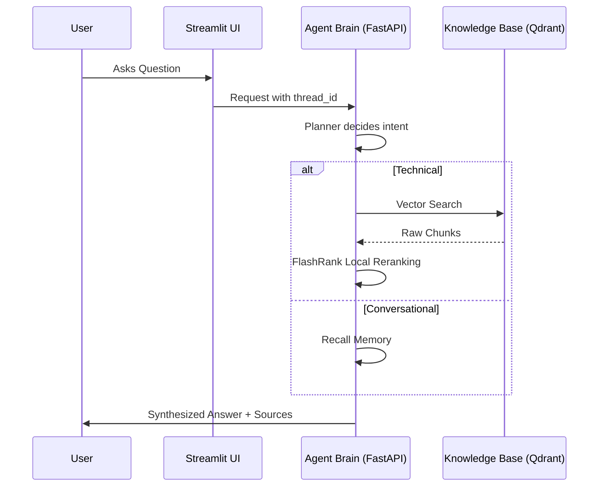

# 🤖 Enterprise Agentic RAG: System Overview

A production-grade, state-of-the-art RAG system built for speed, scalability, and deep observability. This platform leverages **LangGraph** to handle complex reasoning and a fully local, cloud-agnostic stack for document intelligence.

---

## 🌟 Vision
Most RAG systems fail because they treat every query the same. Our **Agentic RAG** distinguishes between:
1.  **Conversational Queries**: "Hi", "Who are you?", "What did I just say?"
2.  **Technical Queries**: "How do I configure Intel SRIOV on Kubernetes?"

By using a **Planner-Retriever-Responder** architecture, we ensure that technical answers are always grounded in "True Data" while conversational interactions remain fluid and fast.

---

## 🏗️ High-Level Flow

---

## 📂 Project Organization
*   **`app/`**: The core Python package containing the Agent, Pipelines, and Services.
*   **`ui/`**: A premium Streamlit interface designed for source transparency.
*   **`DATA/`**: The ground-truth documentation used for ingestion.
*   **`DOCS/`**: This documentation suite.
*   **`commands.md`**: The master execution guide for developers.

---

## 🚀 Quick Navigation
1.  **Ingestion**: [02_INGESTION_ENGINE.md](02_INGESTION_ENGINE.md)
2.  **Intelligence**: [03_NODE_INTELLIGENCE.md](03_NODE_INTELLIGENCE.md)
3.  **Observability**: [04_TRACING_AND_OBSERVABILITY.md](04_TRACING_AND_OBSERVABILITY.md)
4.  **Environment Variables**: [05_ENVIRONMENT_VARIABLES.md](05_ENVIRONMENT_VARIABLES.md)
