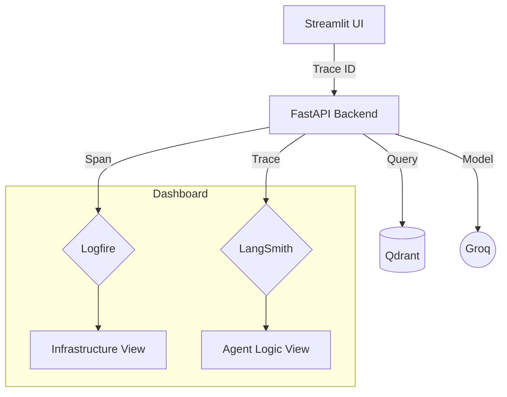

# 🕵️ Tracing & Observability

In an Agentic system, "Why did the AI say that?" is the most important question. We use a dual-tracing strategy to provide total transparency into the agent's thought process.

---

## 🔬 The Observability Stack

### 1. Pydantic Logfire (System Tracing)
Logfire provides distributed tracing for the entire infrastructure. It tracks:
*   **API Latency**: How long the backend takes to respond.
*   **Parsing Steps**: Exactly which parser (pypdf, BS4, python-docx) was used for which file.
*   **Database Queries**: Time taken to retrieve results from Qdrant.

### 2. LangSmith (LLM Orchestration)
LangSmith is specialized for the "Agentic" part of the project. It records:
*   **Graph State Transitions**: How the state changed between the Planner and the Retriever.
*   **Prompt Versions**: The exact system instructions sent to Groq.
*   **Token Usage**: Monitoring the cost and efficiency of LLM calls.
*   **Chain of Thought**: The reasoning steps the agent took before answering.

---

## 📊 Tracing Architecture

---

## 🛠️ How to access
*   **Logfire**: Visit your [Logfire Project](https://logfire.pydantic.dev/).
*   **LangSmith**: Visit your [LangSmith Project](https://smith.langchain.com/).

> [!TIP]
> All traces are linked via a common `trace_id`. If you find a bug in the UI, you can find the exact LLM call in LangSmith and the corresponding Logfire span using that ID.
