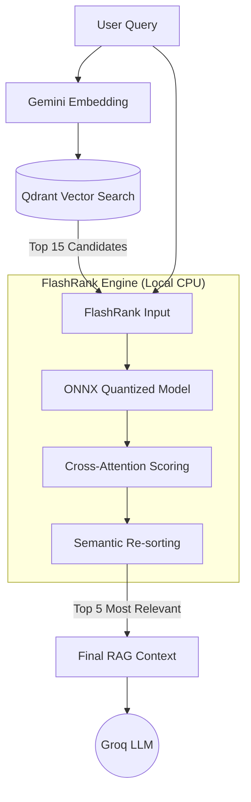

# ⚡ FlashRank: Ultra-Fast Local Reranking

This document explains the mechanism behind **FlashRank**, the semantic reranking engine used in our Retriever node to ensure high-fidelity responses without the cost of cloud-based ranking APIs.

---

## 🔬 The Core Technology: Bi-Encoder vs. Cross-Encoder

In modern RAG systems, there are two main ways to compare a user query with documents:

### 1. The Bi-Encoder (Stage 1: Qdrant)
*   **Mechanism**: The query and the documents are converted into vectors independently. We then calculate the distance (Cosine Similarity) between them.
*   **Pros**: Extremely fast. You can compare 1 query against millions of documents in milliseconds.
*   **Cons**: It is "semantically fuzzy." It doesn't understand the complex relationship between the query and the text (e.g., it might struggle with negation or technical nuances).

### 2. The Cross-Encoder (Stage 2: FlashRank)
*   **Mechanism**: The query and a document are fed into the model **together** as a single pair. The model looks at them simultaneously to calculate a relevance score.
*   **Pros**: Highly accurate. It understands deep context, intent, and nuance.
*   **Cons**: Computationally expensive and slow.

**Our Solution**: We use a **Two-Stage Pipeline**. We use the Bi-Encoder (Qdrant) to quickly find the top 15 candidates, and then use the Cross-Encoder (FlashRank) to precisely re-score only those 15.

---

## 🔄 FlashRank Mechanism Flow

---

## 🛠️ Implementation Details

### The Model
We use the `ms-marco-MiniLM-L-6-v2` model.
*   **Quantization**: The model is quantized into the **ONNX** format, allowing it to run lightning-fast on a standard CPU without needing a GPU.
*   **Performance**: It typically reranks 15-20 documents in **< 100ms**.

### Lazy Initialization
The model is roughly 30MB-50MB. To ensure the API starts up instantly, we use **Lazy Initialization**:
1.  The API starts without loading the model.
2.  The first time a user sends a query, the model is loaded into memory.
3.  Subsequent queries use the warm model for near-instant results.

### Fault Tolerance
If the FlashRank engine fails (e.g., out of memory or model corruption), the system is designed to **automatically fall back** to the original Qdrant scores. This ensures that the user always gets an answer, even if the reranking step is skipped.

---

## 🏛️ Architectural Decision: Custom Implementation vs. LangChain Native

LangChain provides a native `FlashrankRerank` document compressor that can be used inside a `ContextualCompressionRetriever`. While using this wrapper would slightly reduce our lines of code, we explicitly chose a **custom implementation** (`app/services/retrieval/ranking_service.py`) for enterprise production readiness:

1.  **Granular Observability (Logfire)**: LangChain's wrapper abstracts the reranking process into a "black box." Our custom implementation allows us to inject precise `logfire.span()` tracking directly around the Cross-Encoder execution, logging the exact millisecond latency and top semantic scores.
2.  **Startup Performance (Lazy Loading)**: The native LangChain wrapper initializes the heavy ONNX model upon instantiation. This would severely delay the FastAPI server boot time and potentially cause "Logfire poisoning" if imported too early. Our `_get_ranker()` function loads the model *lazily*, ensuring instant server startup.
3.  **Bulletproof Fallback Logic**: If the native LangChain compressor fails, it crashes the entire chain and throws a 500 error. Our custom code catches memory or execution errors and gracefully falls back to the original Bi-Encoder (Qdrant) results, guaranteeing zero downtime.
4.  **Decoupled State Management**: LangChain's retrievers force the use of heavy `Document` objects. Our LangGraph state is intentionally lightweight (using simple `List[str]`), making our custom function much cleaner to integrate without fighting LangChain's object models.

---

## 📈 Benefits for the Enterprise
1.  **Zero Cost**: Runs on your local CPU. No per-query Ranking API costs.
2.  **Privacy**: Documents never leave your machine for the ranking step.
3.  **Accuracy**: Drastically reduces "Hallucinations" by ensuring the LLM only sees the most semantically relevant data.
