# 16 — LLM Gateway with Portkey

> **One-line summary:** An LLM Gateway is a proxy layer that sits between your application and any LLM provider — adding resilience, observability, and cost control with zero changes to your business logic.

---

## What Is an LLM Gateway?

Imagine your application is a restaurant kitchen. The LLM is the supplier (Groq, OpenAI, NVIDIA). Without a gateway, your chef calls the supplier directly every time — and if that one supplier is out of stock, the kitchen shuts down.

An LLM Gateway is like a **purchasing manager** between the kitchen and the suppliers:

- Routes each order to the right supplier
- Automatically tries a backup supplier if the first one fails
- Logs every order for accounting
- Remembers frequently ordered items so you don't pay twice
- Enforces a time limit — if the supplier takes too long, cancel and try someone else

In software terms: **every LLM call goes through the gateway instead of the provider directly**.

```
Your App  →  [LLM Gateway]  →  Groq / NVIDIA / OpenAI / Anthropic
```

---

## Why Do We Need It?

Direct LLM calls work fine in a notebook. In production, they break:

| Problem | What Happens Without a Gateway |
|---|---|
| **Provider rate limit (429)** | App crashes with an error at 3 AM |
| **Provider outage** | Full downtime — no automatic recovery |
| **Slow response / stall** | FastAPI worker hangs indefinitely |
| **Same question 1000 times** | You pay for 1000 LLM calls |
| **Switch providers** | Rewrite every API call across 10+ files |
| **No audit trail** | Zero visibility — impossible to debug or bill |
| **No per-feature analytics** | No idea which part of the app costs the most |

A gateway solves all of these — **centrally, without touching business logic**.

---

## How a Request Flows Through Portkey

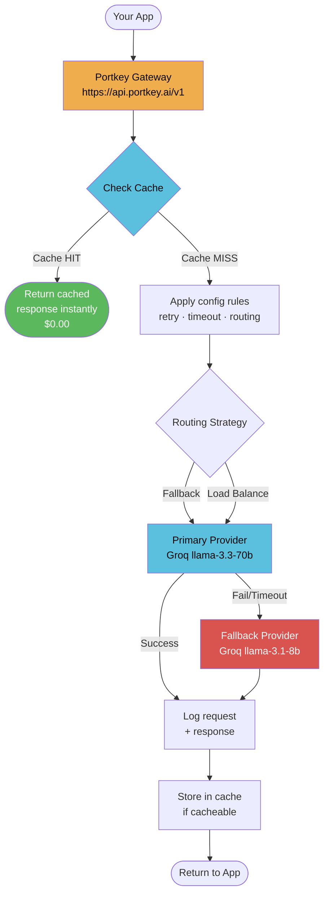

**Key insight:** Your app sends the same API call it always did. Portkey intercepts it, applies all your rules, and returns the response. The provider switch is invisible to your code.

---

## The Two Core Concepts

Before anything else, these two things look similar but are completely different:

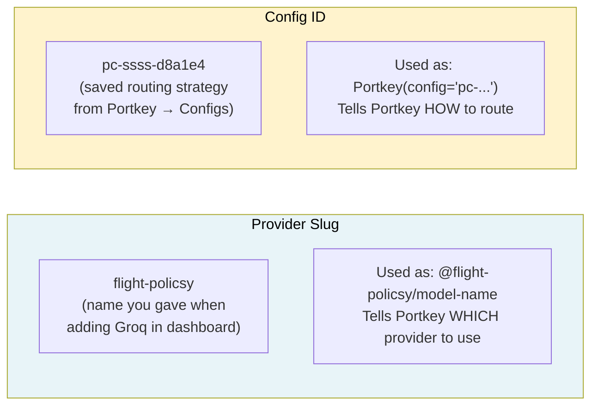

| Thing | Looks like | Answers |
|---|---|---|
| **Provider slug** | `flight-policsy` | *Which provider / model?* |
| **Config ID** | `pc-ssss-d8a1e4` | *How to route, retry, cache?* |

---

## Feature 1 — Basic Routing (Observability for Free)

The simplest use: just route through Portkey. Every call is **automatically logged** in the dashboard — token count, cost, latency, full prompt and response.

```python
from portkey_ai import Portkey

portkey = Portkey(api_key=PORTKEY_API_KEY)

response = portkey.chat.completions.create(
    model="@flight-policsy/llama-3.3-70b-versatile",
    messages=[{"role": "user", "content": "What is Kubernetes?"}]
)
```

**Before vs After:**

```
Before:  Your App  →  Groq directly          (no logs, no visibility)
After:   Your App  →  Portkey  →  Groq        (full dashboard + logs)
```

You changed 3 lines. Business logic: identical.

---

## Feature 2 — Metadata & Observability

Tag every request with user, session, and feature info. Portkey uses these to power per-user analytics, cost breakdowns by feature, and session replay.

```python
response = portkey.with_options(
    metadata={
        "_user":       "alice",           # special key → per-user analytics
        "session_id":  "abc-123",
        "feature":     "enterprise-rag",
        "environment": "production"
    }
).chat.completions.create(model="@flight-policsy/...", messages=[...])
```

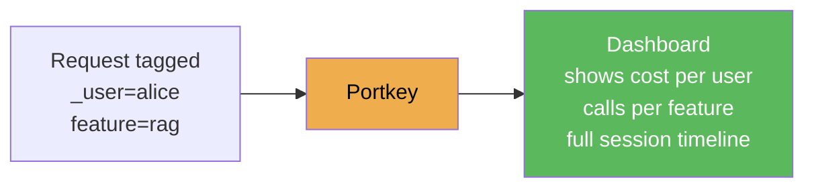

**Questions you can now answer from the dashboard — zero extra logging code:**
- Which user generates the most cost?
- Which feature uses the most tokens?
- Is the RAG pipeline slower than the support bot?

---

## Feature 3 — Automatic Retries

Pass a `config` dict to `Portkey(...)`. On a transient error (rate limit, server error), Portkey retries automatically with exponential backoff. Your app code never sees the failure.

```python
portkey = Portkey(api_key=PORTKEY_API_KEY, config={
    "retry": {
        "attempts":        3,
        "on_status_codes": [429, 500, 502, 503, 504]
    }
})
```

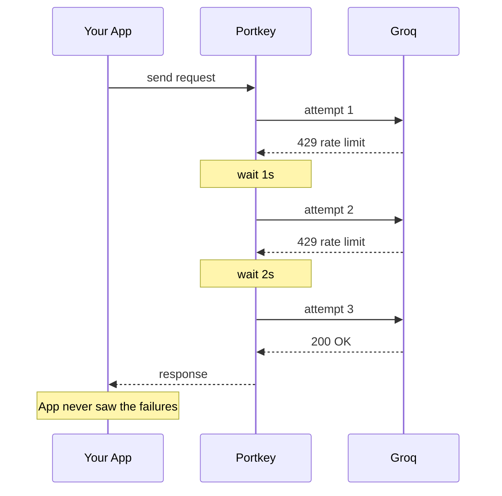

---

## Feature 4 — Request Timeouts

Set a hard time limit in milliseconds. If the LLM stalls, Portkey kills the request and returns HTTP 408. Without this, a slow Groq response blocks a FastAPI worker indefinitely.

```python
portkey = Portkey(api_key=PORTKEY_API_KEY, config={
    "request_timeout": 10000    # 10 seconds in milliseconds
})
```

**Production pattern — combine with retry:**

```python
config = {
    "request_timeout": 10000,
    "retry": {"attempts": 2, "on_status_codes": [408, 429, 503]}
}
```

Timeout fires → 408 → retry kicks in → try again. Users see a slightly slower response instead of a hang.

---

## Feature 5 — Fallbacks

If the primary model fails (any non-2xx), Portkey automatically switches to the next target in the list. Users never see the failure.

```python
portkey = Portkey(api_key=PORTKEY_API_KEY, config={
    "strategy": {"mode": "fallback"},
    "targets": [
        {"override_params": {"model": "@flight-policsy/llama-3.3-70b-versatile"}},  # primary
        {"override_params": {"model": "@flight-policy/llama-3.1-8b-instant"}}       # fallback
    ]
})
```

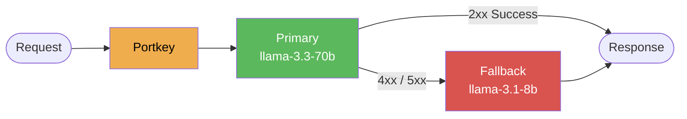

**Narrowing the trigger** (avoids fallback on bad requests):
```python
"strategy": {"mode": "fallback", "on_status_codes": [429, 503]}
```

---

## Feature 6 — Load Balancing

Split traffic between models by weight. Each request is routed probabilistically — 70% to the primary, 30% to the secondary.

```python
portkey = Portkey(api_key=PORTKEY_API_KEY, config={
    "strategy": {"mode": "loadbalance"},
    "targets": [
        {"override_params": {"model": "@flight-policsy/llama-3.3-70b-versatile"}, "weight": 0.7},
        {"override_params": {"model": "@flight-policy/llama-3.1-8b-instant"},     "weight": 0.3}
    ]
})
```

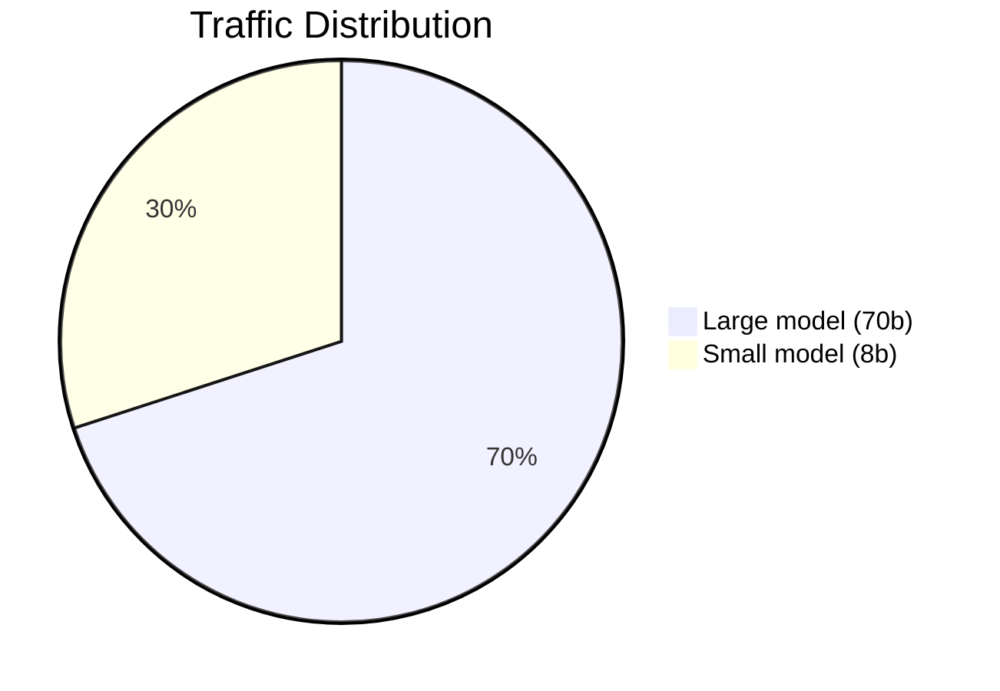

**Use cases:**

| Scenario | Config |
|---|---|
| **Gradual migration** | Start 95/5, shift to 0/100 over weeks |
| **A/B testing** | 50/50 — compare quality per model |
| **Cost control** | Route more traffic to the cheaper model |
| **Maintenance** | `weight: 0` pauses a target without removing it |

---

## Feature 7 — Request Caching

Portkey caches the full response for identical requests. The second call is instant and costs nothing.

```python
portkey = Portkey(api_key=PORTKEY_API_KEY, config={
    "cache": {"mode": "simple"}     # exact-match cache
})
```

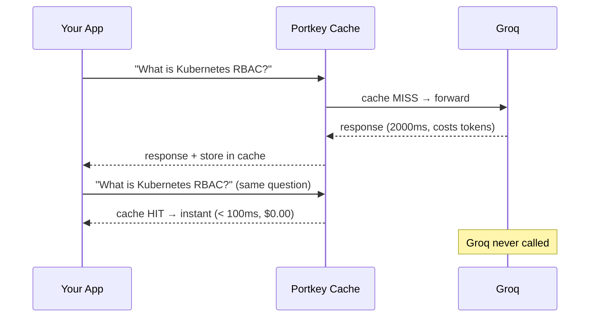

**Verify cache hit:** Portkey Logs → click any request → look for `cache_status: HIT`.

**Force a fresh response** (e.g. after updating your knowledge base):
```python
portkey.with_options(cache_force_refresh=True).chat.completions.create(...)
```

| Cache Mode | How it matches | Plan |
|---|---|---|
| `simple` | Exact request match | Free / Starter |
| `semantic` | Similar meaning match | **Enterprise tier only** |

> **Semantic cache on free/starter plans:** If your Portkey account is not on Enterprise, setting `"mode": "semantic"` silently falls back to simple (exact-match) cache behaviour. No error is thrown. The code is correct to set semantic — it will upgrade automatically when the account tier changes.

---

## Feature 8 — Saved Configs from Dashboard

Build your routing strategy once in the Portkey dashboard. Save it. Reference the `pc-` ID everywhere. Update the strategy centrally — no redeployment needed.

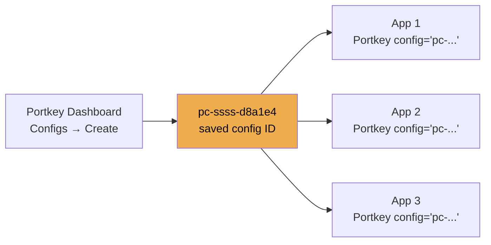

```python
portkey = Portkey(api_key=PORTKEY_API_KEY, config="pc-ssss-d8a1e4")
```

**Why this matters:** You can change the fallback order, retry counts, or timeout from the dashboard at midnight without touching code or triggering a deploy. Any app holding that config ID picks up the change instantly.

---

## Feature 9 — LangChain Drop-In

Portkey exposes an OpenAI-compatible endpoint. Swap `ChatGroq` for `ChatOpenAI` pointing at Portkey — zero changes to chain logic, prompts, or LangGraph wiring.

> **Why ChatOpenAI and not ChatGroq?**
>
> Every LLM company's API has an **address** (URL):
> - Groq's address: `https://api.groq.com/openai/v1`
> - Portkey's address: `https://api.portkey.ai/v1`
>
> `ChatGroq` has Groq's address **hardcoded inside it**. You cannot change where it sends requests.
>
> `ChatOpenAI` has a `base_url` parameter — it will send to **whatever address you give it**. So you point it at Portkey's address instead:
>
> ```python
> ChatOpenAI(base_url="https://api.portkey.ai/v1")  # now talking to Portkey, not OpenAI
> ```
>
> The "OpenAI" in `ChatOpenAI` doesn't mean OpenAI the company. It means **"speaks the OpenAI API format"** — which Portkey, Groq, and most modern LLM providers all do. It has become the industry-standard format. So `ChatOpenAI` is really just a flexible LLM client that speaks the standard format and lets you point it anywhere.
>
> You are still using Groq models. Portkey just sits in the middle.
>
> ```
> ChatGroq                                    →  Groq directly  (hardcoded, no Portkey)
> ChatOpenAI(base_url=PORTKEY_GATEWAY_URL)   →  Portkey  →  Groq
> ```

```python
from langchain_openai import ChatOpenAI
from portkey_ai import createHeaders, PORTKEY_GATEWAY_URL

# Before (direct Groq)
llm = ChatGroq(api_key=GROQ_API_KEY, model="llama-3.3-70b-versatile")

# After (Portkey gateway — everything else unchanged)
llm = ChatOpenAI(
    api_key=PORTKEY_API_KEY,
    base_url=PORTKEY_GATEWAY_URL,
    model="@flight-policsy/llama-3.3-70b-versatile",
    default_headers=createHeaders(
        api_key=PORTKEY_API_KEY,
        metadata={"feature": "rag-pipeline", "_user": "system"}
    )
)
```

Every LangGraph node — planner, retriever, responder — is now logged, retried, and fallback-protected without changing any node logic.

---

## Full Production Config

Combine everything for a production-grade gateway:

```python
PRODUCTION_CONFIG = {
    "strategy":        {"mode": "fallback"},
    "request_timeout": 30000,                           # 30s hard cap
    "retry": {
        "attempts":        2,
        "on_status_codes": [429, 500, 503]
    },
    "cache": {"mode": "simple"},
    "targets": [
        {"override_params": {"model": "@flight-policsy/llama-3.3-70b-versatile"}},
        {"override_params": {"model": "@flight-policy/llama-3.1-8b-instant"}}
    ]
}

gateway = Portkey(api_key=PORTKEY_API_KEY, config=PRODUCTION_CONFIG)
```

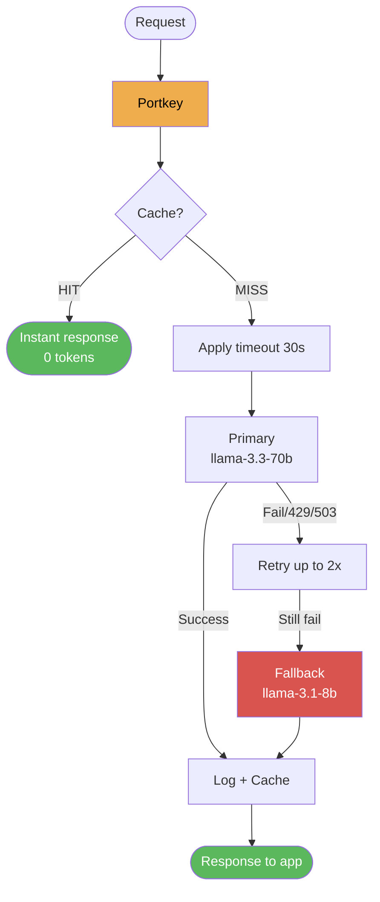

---

## Integrating the Gateway into the RAG API

In our FastAPI backend, the gateway wraps the LLM before it reaches LangGraph:

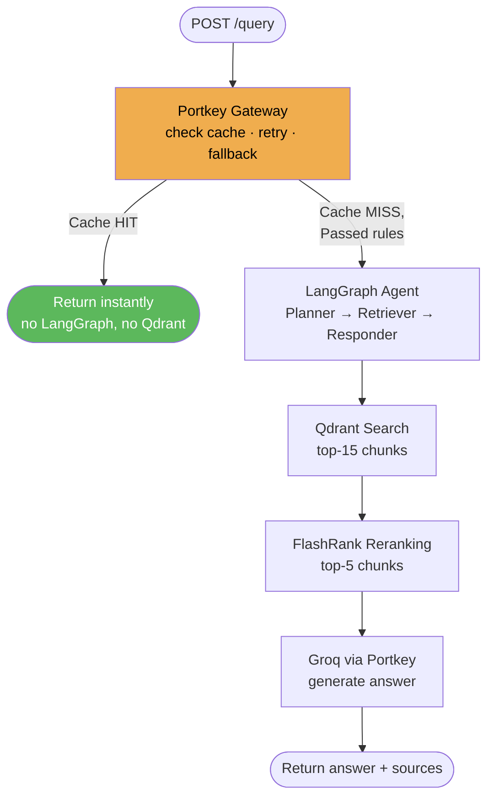

```python
# app/main.py
from portkey_ai import Portkey, createHeaders, PORTKEY_GATEWAY_URL
from langchain_openai import ChatOpenAI

gateway_llm = ChatOpenAI(
    api_key=PORTKEY_API_KEY,
    base_url=PORTKEY_GATEWAY_URL,
    model="@flight-policsy/llama-3.3-70b-versatile",
    default_headers=createHeaders(
        api_key=PORTKEY_API_KEY,
        config=PRODUCTION_CONFIG,
        metadata={"feature": "rag-query"}
    )
)
```

---

## Gateway vs Guardrails — What's the Difference?

These two work at different layers and do different jobs:

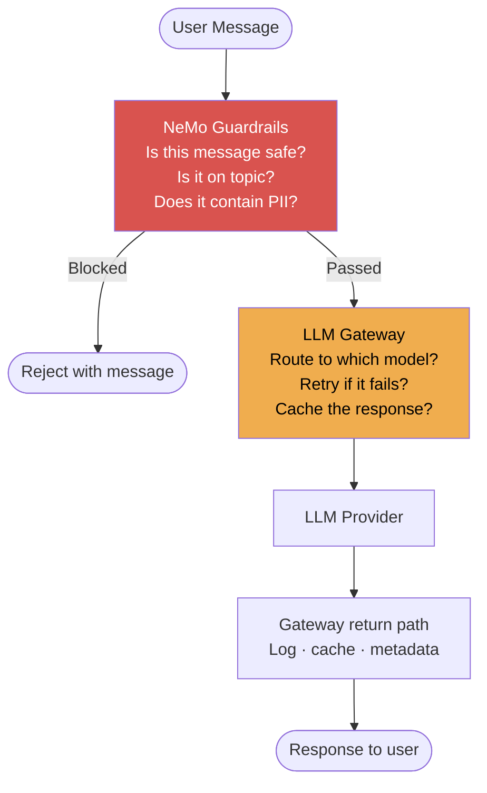

| | Guardrails | Gateway |
|---|---|---|
| **Asks** | *Should this request happen at all?* | *How should this request be sent?* |
| **Layer** | Before the LLM pipeline | Around every LLM call |
| **Blocks** | Jailbreaks, off-topic, PII | Nothing — routes and retries |
| **Tool** | NeMo Guardrails (Colang) | Portkey |

Use both together: guardrails at the gate, gateway for everything that passes through.

---

## Framework Comparison

| Framework | Type | Dashboard | Fallbacks | Caching | Best For |
|---|---|---|---|---|---|
| **Portkey** | Managed proxy + SDK | ✅ Beautiful | ✅ | ✅ | Enterprise observability + configs |
| **LiteLLM** | Python library | ⚠️ Basic | ✅ | ✅ | Pure code, no dashboard needed |
| **Azure AI Gateway** | Azure managed | ✅ Azure Portal | ✅ | ✅ | Azure-native workloads |
| **AWS Bedrock** | AWS managed | ✅ CloudWatch | ✅ | ✅ | AWS-native workloads |
| **Direct SDK** | No proxy | ❌ None | ❌ Manual | ❌ Manual | Prototyping only |

**Why Portkey for this system:**
- LLM-agnostic — Groq today, any provider tomorrow, no code changes
- Dashboard built for debugging RAG systems (full prompt + response logs)
- Config-as-JSON means routing rules can change without redeploy
- LangChain drop-in keeps all existing node code untouched
- Open source (Apache 2.0), runs as self-hosted or managed

---

## Quick Reference — Config Keys

| Key | What it does | Example value |
|---|---|---|
| `strategy.mode` | Routing strategy | `"fallback"` / `"loadbalance"` |
| `strategy.on_status_codes` | Narrow fallback trigger | `[429, 503]` |
| `retry.attempts` | Max retry count | `3` |
| `retry.on_status_codes` | Which errors trigger retry | `[429, 500, 502, 503, 504]` |
| `request_timeout` | Hard time limit in ms | `10000` (10 seconds) |
| `cache.mode` | Caching strategy | `"simple"` / `"semantic"` |
| `targets[].override_params.model` | Model for this target | `"@slug/model-name"` |
| `targets[].weight` | Load balance weight | `0.7` (70%) |

## Quick Reference — Python API

| Method | What it does |
|---|---|
| `Portkey(api_key=..., config={...})` | Client with inline config |
| `Portkey(api_key=..., config="pc-...")` | Client with saved dashboard config |
| `portkey.chat.completions.create(model="@slug/model", ...)` | Standard LLM call via gateway |
| `portkey.with_options(metadata={...})` | Override options for one request |
| `portkey.with_options(cache_force_refresh=True)` | Bypass cache for this request |
| `createHeaders(api_key=..., metadata={...})` | Build headers for LangChain integration |
| `PORTKEY_GATEWAY_URL` | `https://api.portkey.ai/v1` — the proxy endpoint |

---

## See Also

- `notebooks/02_llm_gateway.ipynb` — live runnable experiments from baseline to full production gateway
- `app/main.py` — FastAPI entry point where the gateway wraps all LLM calls
- `app/agents/nodes/` — swap `ChatGroq` for `ChatOpenAI` + Portkey here
- `DOCS/08_GUARDRAILS.md` — NeMo Guardrails (the safety layer that runs before the gateway)

---

## How We Integrated the Gateway in This System

All gateway logic lives in `app/gateway/` and integrates into the LangGraph nodes.

### Files Created

```
app/gateway/
  __init__.py    ← exports portkey_client, get_langchain_llm, extract_cache_status
  client.py      ← GATEWAY_CONFIG, native Portkey client, LangChain LLM factory
```

### The Gateway Config We Use

Only two features are enabled — everything else (load balancing, timeouts, metadata) is available but not needed for this use case:

```python
# app/gateway/client.py

GATEWAY_CONFIG = {
    "strategy": {"mode": "fallback"},   # primary → fallback on non-2xx
    "cache": {"mode": "semantic"},      # Enterprise: similarity match; free: exact match
    "retry": {
        "attempts": 2,
        "on_status_codes": [429, 503]   # retry before triggering the fallback
    },
    "targets": [
        {"override_params": {"model": "@rag/llama-3.3-70b-versatile"}},    # primary
        {"override_params": {"model": "@brag/llama-3.1-8b-instant"}},      # fallback
    ]
}
```

**Slugs:** `rag` and `brag` are the Portkey dashboard integration names for the two Groq API keys. The fallback key is stored in `.env` as `GROQ_FALLBACK_API_KEY` — Portkey reads it from the `brag` dashboard integration, not from code.

### Two Clients, Two Purposes

| Client | Used in | Why |
|---|---|---|
| `portkey_client` (native) | `responder.py` | Exposes response headers → can read `x-portkey-cache-status` |
| `get_langchain_llm()` (ChatOpenAI) | `planner.py` | Preserves `.invoke()` interface — zero logic changes to node |

### Cache Hit Detection

The Portkey Python SDK does not expose response headers on the plain `.create()` return object directly. `extract_cache_status()` in `app/gateway/client.py` checks several private attribute paths (`_raw_response`, `_response`, `_http_response`) that different SDK versions may use. If none are found it returns `"MISS"` — the app works normally, the cache still happens on Portkey's side, and the hit is visible in the Portkey dashboard. The UI label is best-effort.

```python
# app/gateway/client.py

def extract_cache_status(response) -> str:
    for attr in ("_raw_response", "_response", "_http_response"):
        raw = getattr(response, attr, None)
        if raw is not None:
            status = getattr(raw, "headers", {}).get("x-portkey-cache-status", "")
            if status:
                return status.upper()
    return "MISS"
```

```python
# app/agents/nodes/responder.py

response = portkey_client.chat.completions.create(
    messages=[{"role": "user", "content": prompt}],
    temperature=0.1
)
content = response.choices[0].message.content
cache_status = extract_cache_status(response)
is_cache_hit = cache_status == "HIT"
```

### What Shows in the UI

The `thought_process` field in the API response (shown as the plan in the UI) reflects the cache status:

| Scenario | `thought_process` |
|---|---|
| Technical question, cache miss | `["Intent: Technical", "Search Term: ...", "Context Retrieved"]` |
| Technical question, cache hit | `["Intent: Technical", "Search Term: ...", "Context Retrieved", "Cache: Hit ⚡"]` |
| Conversational | `["Intent: Conversational/Memory", "Retrieval: Skipped"]` |
| Guardrails fired | `["Intent: Guardrails Fired", "Retrieval: Skipped"]` |

### Logfire Events Added

| Event | Trigger |
|---|---|
| `⚡ Gateway Cache Hit` | `x-portkey-cache-status: HIT` in responder response |
| `✅ Response synthesised via LLM` | Normal generation (cache miss) |

### Portkey Dashboard — Automatic

Every request that passes through Portkey (planner + responder) is **automatically visible** in portkey.ai → Logs with no extra code: full prompt, response, token count, cost, latency, model actually used (primary or fallback), and cache status (HIT/MISS). This works purely because the `PORTKEY_API_KEY` is present in every request.
