# 17 — Evaluating RAG Systems

> **One-line summary:** Evals are automated tests that measure whether your RAG pipeline is actually giving correct, grounded, and relevant answers — before users tell you it isn't.

---

## What Are Evals?

When you build a RAG system, you can eyeball a few responses and say "looks good." But that is not enough for production. What if it hallucinates on edge cases? What if the retriever misses critical chunks? What if the answer is technically correct but completely ignores what was asked?

**Evals** (evaluations) are structured, repeatable tests that measure specific failure modes with a score.

Think of it like this:

> A human doctor can seem fine in casual conversation. You only know they are good when you test them on 100 cases with known answers. Evals are that test — for your AI.

### What an Eval Looks Like

```python
# You provide: question + what was retrieved + what the LLM said + ground truth
sample = SingleTurnSample(
    user_input      = "Do you offer free return shipping?",
    retrieved_contexts = ["Customers are responsible for return shipping costs."],
    response        = "Yes, we provide free prepaid return labels for all returns.",
    reference       = "No. Customers pay return shipping unless item is defective.",
)

# A judge LLM scores it
score = await Faithfulness(llm=judge_llm).abatch_score([sample])
# → 0.0 (the response directly contradicts the context — hallucination detected)
```

---

## Terminology — The Words You Will See Everywhere

Before diving into metrics, here are all the terms used in the eval world. These come up constantly in RAGAS, DeepEval, research papers, and team conversations.

---

### The Building Blocks

**Sample / Test Case**
A single unit of evaluation. One question, one set of retrieved chunks, one LLM response, optionally one known correct answer. Everything else operates on samples.

```
Sample = { user_input, retrieved_contexts, response, reference }
```

---

**Ground Truth**
The known correct answer for a given question — written by a human or expert. This is what you compare the LLM's response against to check factual accuracy.

> "The boiling point of water is 100°C" is the ground truth.
> If the LLM says 90°C, the ground truth catches it.

Not every metric needs ground truth. Faithfulness and Answer Relevancy work without it — they only need the question, context, and response.

---

**Reference**
The RAGAS term for ground truth. Same concept — the correct, trusted answer you compare against.

```python
SingleTurnSample(
    user_input = "Who invented the telephone?",
    response   = "Edison invented the telephone.",   # what the LLM said
    reference  = "Alexander Graham Bell invented the telephone in 1876."  # ground truth
)
```

---

**Golden / Golden Dataset**
A carefully curated, high-quality collection of test cases with verified ground truth answers. "Golden" means these are the authoritative test cases — they do not change unless someone deliberately updates them.

Think of it as your system's **permanent exam paper**. Every time you change your pipeline (new LLM, new retriever, new prompt), you run it against the golden dataset to see if scores went up or down.

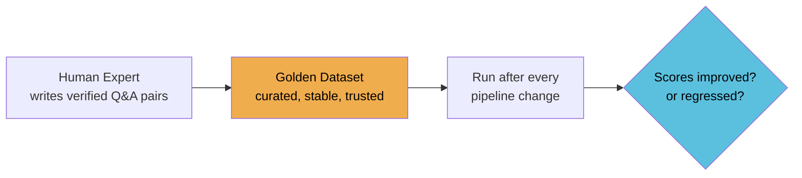

> **Golden vs regular dataset:** A regular dataset is any test data. A golden dataset is one that has been reviewed, verified, and is treated as the source of truth for benchmarking.

---

**Dataset**
A collection of samples used for evaluation. Can be:

| Type | What it is | When to use |
|---|---|---|
| **Golden dataset** | Curated, verified, stable | Regression testing, benchmarks |
| **Synthetic dataset** | Auto-generated by an LLM | Cheap, fast — good for early testing |
| **Live dataset** | Real user queries from production | Most realistic, but needs privacy handling |
| **Adversarial dataset** | Deliberately tricky edge cases | Stress testing, red-teaming |

---

**Synthetic Data / Synthetic Dataset**
Test cases generated automatically by an LLM rather than written by a human. You give the LLM your documents and ask it to generate questions and answers.

- **Pro:** Fast and cheap to create — generate 100 samples in minutes
- **Con:** The generating LLM can have the same blind spots as the evaluated LLM — so synthetic evals can miss real failure modes

> RAGAS has a `TestsetGenerator` that creates synthetic golden datasets from your documents automatically. Useful when you don't have real user data yet.

---

**Judge LLM / LLM-as-Judge**
A second, separate LLM that scores the output of your RAG system. Instead of hardcoded rules, you ask an LLM: *"Does this answer faithfully use the context? Score 0 to 1."*

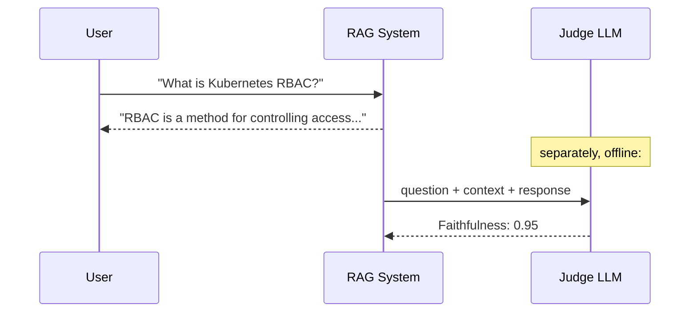

**Why a separate LLM for judging?** Because you should not ask the same LLM that generated the answer to evaluate its own answer — it will almost always say it did well. Using a separate judge (even a smaller, cheaper model like `llama-3.1-8b-instant`) gives you a more objective score.

In this project: `llama-3.3-70b-versatile` generates answers, `llama-3.1-8b-instant` judges them.

---

**Hallucination**
When an LLM generates a "fact" that is not in the provided context and may not be true. The most dangerous failure mode in RAG systems — users trust AI responses and may not know they are false.

```
Context says:  "Returns must be made within 30 days."
LLM says:      "Returns must be made within 30 days and you get a 10% discount coupon."
                                                       ↑ hallucinated — never in context
```

Faithfulness metric catches this directly.

---

**Grounding / Groundedness**
Whether the answer is *supported by* the source context. A grounded answer only uses information present in the retrieved chunks. An ungrounded answer adds information from the LLM's training data or makes things up.

> Faithfulness measures grounding. Score = 1.0 means fully grounded (zero hallucination).

---

**Reference-Free Metric**
A metric that can evaluate a response **without needing a ground-truth reference**. It only looks at the question, context, and response.

| Reference-Free | Reference-Required |
|---|---|
| Faithfulness | Context Precision |
| Answer Relevancy | Context Recall |
| | Answer Correctness |

Reference-free metrics are valuable in production because you often don't have ground truth for every real user question.

---

**Chunk / Context Chunk**
A segment of a document that has been split, embedded, and stored in the vector database. When a user asks a question, the retriever fetches the top-k most similar chunks and passes them to the LLM as context.

```
Full document  →  split into chunks  →  stored in Qdrant
User question  →  embed question     →  fetch top-k similar chunks → LLM context
```

The quality of chunks (size, overlap, splitting strategy) directly affects Context Precision and Context Recall scores.

---

**Top-k**
The number of chunks the retriever fetches. `top_k=15` means retrieve the 15 most similar chunks. A higher k increases recall (less likely to miss something) but decreases precision (more noise).

In this system: retriever fetches top-15, FlashRank reranker keeps top-5.

---

**Precision vs Recall — The Core Trade-off**

These two concepts come from classical information retrieval and underpin two of the six RAGAS metrics.

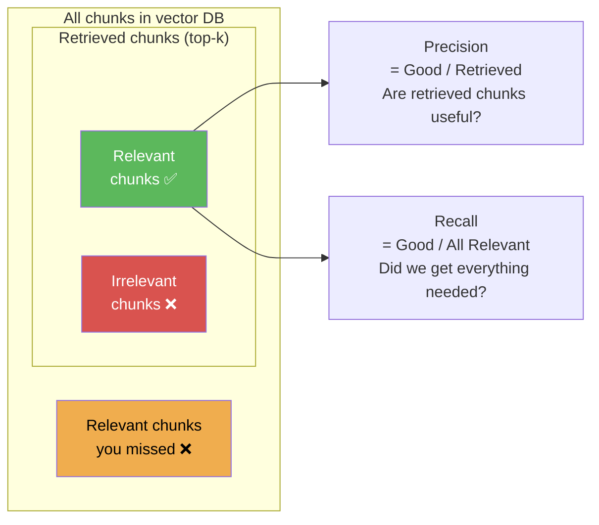

| | High | Low |
|---|---|---|
| **Precision** | Retrieved chunks are mostly relevant | Retrieved chunks contain a lot of noise |
| **Recall** | Fetched all the chunks the answer needs | Missed chunks that the answer needed |

You usually cannot maximise both at once — increasing top-k raises recall but drops precision.

---

**Baseline**
The eval scores of your current system before making any changes. Always record a baseline before modifying the retriever, LLM, or prompts — otherwise you cannot tell if a change helped or hurt.

---

**Regression**
When a change to the pipeline causes eval scores to drop below the baseline. Like software regression testing — you want to catch this before deployment, not after.

---

**Offline Eval vs Online Eval**

| | Offline Eval | Online Eval |
|---|---|---|
| **When** | Before deployment, on a fixed dataset | In production, on real user traffic |
| **Data** | Golden dataset / synthetic samples | Real queries from real users |
| **Cost** | Controlled — you choose the sample size | Can be expensive at scale |
| **Speed** | As fast as you run it | Continuous |
| **Use** | Catch regressions before release | Monitor for drift over time |

This notebook runs **offline evals** on synthetic mock data. In production you would pipe real queries into the same metrics via Logfire.

---

**Benchmark**
A standardised eval dataset used to compare different systems or models on the same task. Public benchmarks (like MMLU, HotpotQA, BEIR) let you compare your system against others. Internal benchmarks are your golden dataset.

---

## Why Do We Need Evals?

Without evals, you are flying blind. A RAG pipeline has **three places things can break** silently:

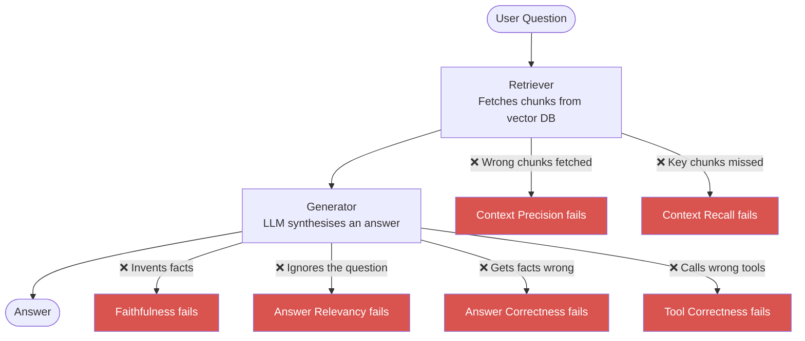

| Without Evals | With Evals |
|---|---|
| Users report bugs in production | You catch them before deployment |
| "It seems fine" is the only check | Quantified scores per failure mode |
| No way to know if a change helped | A/B compare scores before and after |
| Hallucinations discovered by accident | Faithfulness score flags them automatically |
| Retrieval quality unknown | Precision + Recall measured objectively |

---

## Evaluation Approaches — Not Just LLM-as-Judge

LLM-as-judge is one method. There are five distinct approaches to evaluating AI systems, each with different cost, speed, accuracy, and use cases.

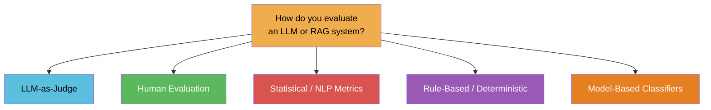

---

### 1. LLM-as-Judge

A second LLM is used to score the output of your system. The judge reads the question, context, and response, then produces a score with reasoning.

**How it works:**
```
Judge prompt: "Does the following answer only use facts from the context? Score 0-1."
Judge input:  question + retrieved_contexts + response
Judge output: 0.73 + reasoning
```

**Used by:** RAGAS (Faithfulness, Relevancy, Precision, Recall, Correctness), DeepEval, TruLens

| Pros | Cons |
|---|---|
| Handles nuance and semantics | Costs tokens per evaluation |
| No hardcoded rules needed | Non-deterministic — same input can give slightly different scores |
| Works on free-form text | Judge LLM can have its own biases |
| Scales to any domain | Slower than rule-based checks |

> **Key rule:** Never use the same LLM that generated the answer to judge it — it will almost always rate itself highly. Use a separate, ideally smaller model as judge.

---

### 2. Human Evaluation

A human reads the question, context, and response and scores it manually. The gold standard — but expensive and slow.

**Types:**

| Type | How | Best For |
|---|---|---|
| **Direct scoring** | Human rates 1–5 on fluency, accuracy, helpfulness | Overall quality |
| **Preference / A/B** | Human picks which of two responses is better | Comparing model versions |
| **Annotation / labelling** | Human marks spans as correct / hallucinated / irrelevant | Building golden datasets |
| **Crowd-sourced** | Scale AI, Surge AI — many annotators for high volume | Large-scale benchmarks |

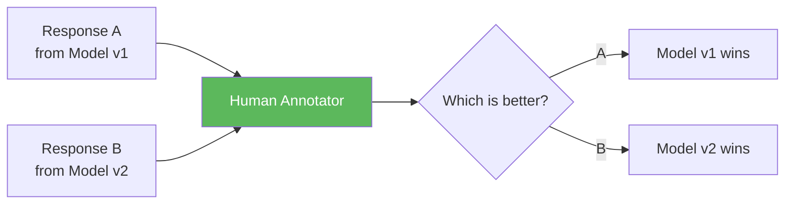

| Pros | Cons |
|---|---|
| Most accurate — humans understand nuance | Very expensive at scale |
| Catches failure modes LLMs miss | Slow — can't run after every commit |
| Required for building golden datasets | Inter-annotator disagreement |
| No model bias | Doesn't scale to production monitoring |

> **In practice:** Human eval is used to **build** the golden dataset and to **validate** that your LLM-as-judge scores are calibrated correctly. You don't run it continuously.

---

### 3. Statistical / NLP Metrics

Older metrics from the NLP era — compare the generated text to a reference string mathematically, without any LLM.

| Metric | What it measures | How |
|---|---|---|
| **BLEU** | N-gram overlap between response and reference | Count matching word sequences |
| **ROUGE** | Recall-oriented n-gram overlap | Widely used for summarisation |
| **METEOR** | BLEU + synonym matching + stemming | Better for paraphrases |
| **BERTScore** | Semantic similarity using BERT embeddings | Compares meaning, not just words |
| **Cosine Similarity** | How close two embeddings are in vector space | Fast, no LLM needed |

```
Reference: "Alexander Graham Bell invented the telephone in 1876."
Response:  "Bell created the first working telephone and patented it in 1876."

BLEU score  → low  (different words, low n-gram overlap)
BERTScore   → high (same meaning, embeddings are close)
```

**The problem with BLEU/ROUGE for RAG:**

These metrics were designed for translation and summarisation where the reference is a single correct phrasing. In RAG, a response can be completely correct but phrased differently — BLEU punishes it unfairly.

| Pros | Cons |
|---|---|
| Zero cost — no LLM needed | BLEU/ROUGE miss paraphrases and synonyms |
| Fully deterministic | Don't capture meaning — only word overlap |
| Instant — milliseconds per sample | Poor correlation with human judgement for open-ended answers |
| Good for structured / templated outputs | Not suitable as the primary metric for free-form RAG answers |

> **When to use:** BLEU/ROUGE are still useful for **structured outputs** (SQL generation, code, templated responses) where exact phrasing matters. BERTScore is the better choice when meaning matters more than exact words.

---

### 4. Rule-Based / Deterministic Evaluation

Write explicit Python rules that check specific properties of the output. No LLM, no model — just code.

**Examples:**

```python
# Format check — did the LLM return valid JSON?
def check_json_output(response: str) -> bool:
    try:
        json.loads(response)
        return True
    except:
        return False

# Length check — is the answer suspiciously short?
def check_length(response: str, min_words=10) -> bool:
    return len(response.split()) >= min_words

# Keyword check — did the answer mention the required term?
def check_contains_keyword(response: str, keyword: str) -> bool:
    return keyword.lower() in response.lower()

# Tool correctness (Jaccard) — used in this project's Exp 6
def tool_correctness_score(called, expected) -> float:
    union = len(called | expected)
    return len(called & expected) / union if union > 0 else 0.0
```

| Pros | Cons |
|---|---|
| Zero cost | Can only check what you explicitly define |
| Fully deterministic — same input, same result | Brittle — misses nuanced failures |
| Instant | Requires domain knowledge to write good rules |
| Great for structural checks (format, length, tool names) | Cannot evaluate meaning or factual accuracy |

> **Tool Correctness in this project is rule-based** — Jaccard set overlap. No LLM, no embeddings. Works because tool names are discrete identifiers, not free-form text.

---

### 5. Model-Based Classifiers

A fine-tuned classification model that outputs a binary or categorical label (safe/unsafe, correct/incorrect, on-topic/off-topic). Faster and cheaper than LLM-as-judge, but less flexible.

**Examples in production:**

| Model | What it classifies | Used by |
|---|---|---|
| **LlamaGuard** | Safe vs unsafe content | Meta — binary safety check |
| **Perspective API** | Toxicity, threat, insult | Google |
| **Custom BERT classifier** | On-topic vs off-topic for your domain | Fine-tuned internally |
| **OpenAI Moderation API** | Content policy violations | OpenAI |

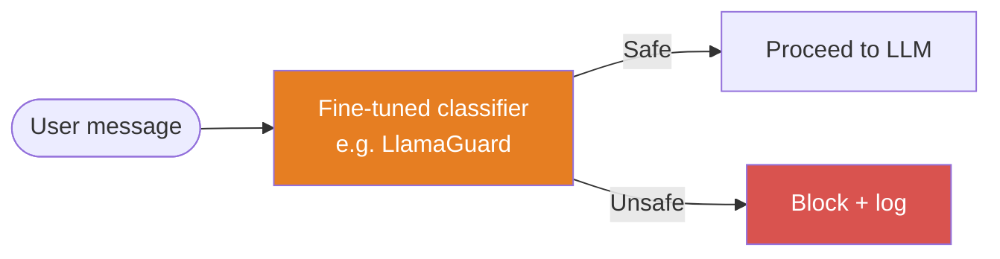

| Pros | Cons |
|---|---|
| Very fast — inference only, no generation | Less flexible than LLM-as-judge |
| Cheap at scale | Requires fine-tuning for domain-specific use |
| Deterministic once trained | Binary outputs miss nuance |
| Great for safety and content moderation | Not useful for quality metrics (faithfulness, relevancy) |

---

### Comparison — All 5 Approaches

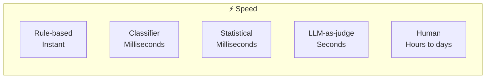

| Approach | Cost | Speed | Accuracy | Scales? | Best for |
|---|---|---|---|---|---|
| **LLM-as-Judge** | Medium (tokens) | Seconds | High | ✅ | Faithfulness, relevancy, factual quality |
| **Human Eval** | Very high | Days | Highest | ❌ | Building golden datasets, validation |
| **Statistical (BLEU/BERTScore)** | Free | Instant | Low–Medium | ✅ | Structured outputs, translation, summarisation |
| **Rule-Based** | Free | Instant | Medium | ✅ | Format, length, tool names, structural checks |
| **Classifier** | Low | Milliseconds | Medium | ✅ | Safety, content moderation, binary checks |

### Decision Guide — Which to Use When

| You want to check... | Use |
|---|---|
| Does the answer hallucinate? | LLM-as-Judge (Faithfulness) |
| Is the answer factually correct? | LLM-as-Judge (Answer Correctness) |
| Did the agent call the right tool? | Rule-Based (Jaccard / Tool Correctness) |
| Is the response format valid JSON / SQL? | Rule-Based |
| Is the content safe / non-toxic? | Classifier (LlamaGuard, Perspective) |
| Which of two model versions is better? | Human Eval (A/B preference) |
| Building a golden dataset? | Human Annotation |
| Evaluating summarisation or translation? | Statistical (ROUGE, BERTScore) |
| Monitoring production at scale, continuously? | LLM-as-Judge + Rule-Based combined |

> **This project uses LLM-as-Judge (RAGAS) for 5 metrics and Rule-Based (Jaccard) for tool correctness** — matching the right approach to the right type of check.

---

## The 6 Failure Modes and Their Metrics

Each metric isolates **one specific thing** that can go wrong. Together they give full pipeline coverage.

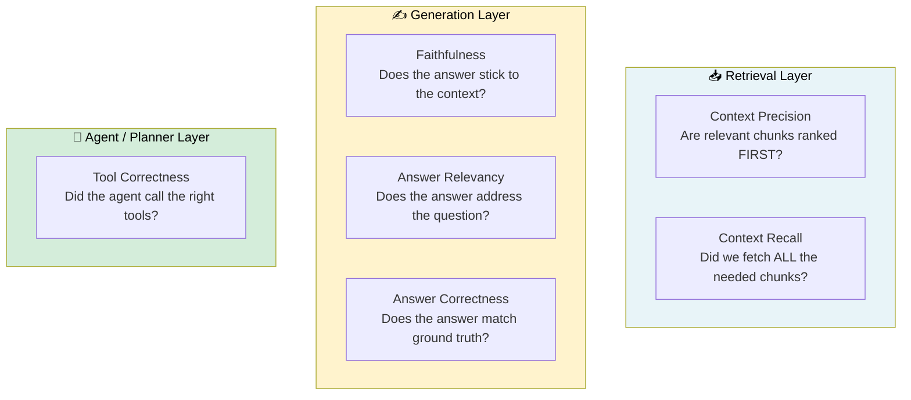

### Metric Details

| # | Metric | Library | What it asks | Score = 1.0 means |
|---|--------|---------|-------------|-------------------|
| 1 | **Faithfulness** | RAGAS | Does every sentence in the answer come from the retrieved context? | Zero hallucination |
| 2 | **Answer Relevancy** | RAGAS | Does the answer directly address what was asked? | Perfectly on-topic |
| 3 | **Context Precision** | RAGAS | Are the useful chunks ranked above the noisy ones? | Best chunks ranked first |
| 4 | **Context Recall** | RAGAS | Did the retriever fetch all facts the reference answer needs? | Nothing important missed |
| 5 | **Answer Correctness** | RAGAS | Does the answer match the known ground-truth reference? | Factually identical |
| 6 | **Tool Correctness** | DeepEval | Did the agent call the right tools (no more, no less)? | Exact tool match |

---

### What Inputs Does Each Metric Need?

| Metric | `user_input` | `retrieved_contexts` | `response` | `reference` | Judge LLM? | Embeddings? |
|--------|:---:|:---:|:---:|:---:|:---:|:---:|
| Faithfulness | ✅ | ✅ | ✅ | ❌ | ✅ | ❌ |
| Answer Relevancy | ✅ | ✅ | ✅ | ❌ | ✅ | ✅ |
| Context Precision | ✅ | ✅ | ❌ | ✅ | ✅ | ❌ |
| Context Recall | ✅ | ✅ | ❌ | ✅ | ✅ | ❌ |
| Answer Correctness | ✅ | ❌ | ✅ | ✅ | ✅ | ✅ |
| Tool Correctness | ✅ | ❌ | ✅ | ❌ | ❌ | ❌ |

> ⚡ **Tool Correctness is fully deterministic** — it uses a Jaccard score (set overlap) between called tools and expected tools. Zero LLM calls, zero cost, no rate limits.

---

### Score Thresholds

| Score | Verdict | What to do |
|-------|---------|------------|
| ≥ 0.75 | 🟢 Good | Safe to ship |
| 0.50 – 0.74 | 🟡 Fair | Investigate before shipping |
| < 0.50 | 🔴 Poor | Fix before shipping |

---

## Evaluation Frameworks — Which One to Use?

There are several frameworks for evaluating LLM and RAG systems. They are not interchangeable — each solves a different problem.

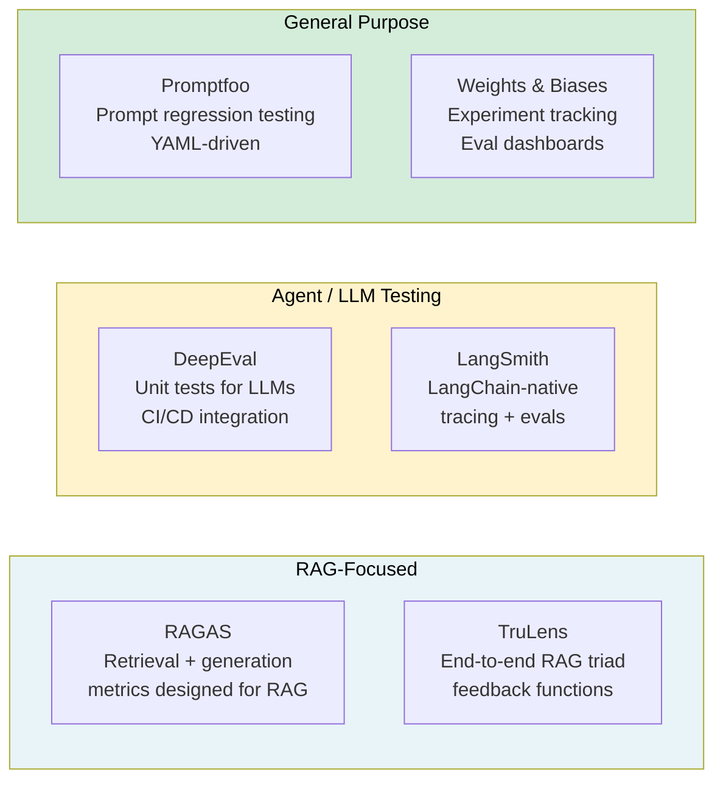

### Framework Comparison Table

| Framework | Best For | Metrics Included | LLM-as-judge? | RAG-native? | CI/CD friendly? |
|---|---|---|---|---|---|
| **RAGAS** | RAG pipeline evaluation | Faithfulness, Precision, Recall, Relevancy, Correctness | ✅ | ✅ Best in class | ✅ |
| **DeepEval** | LLM unit tests + agent tool testing | 14+ metrics incl. Tool Correctness, Hallucination, Bias | ✅ | ✅ | ✅ pytest plugin |
| **TruLens** | End-to-end RAG triad (groundedness, relevance, retrieval) | RAG Triad | ✅ | ✅ | ⚠️ More manual |
| **LangSmith** | LangChain-native tracing + evals | Custom + built-in | ✅ | ⚠️ Good but generic | ✅ |
| **Promptfoo** | Prompt regression testing across model versions | Custom assertions | ✅ | ❌ Not RAG-specific | ✅ |
| **Weights & Biases** | Experiment tracking + eval dashboards | Custom | ✅ | ❌ | ✅ |

### When to Use Which

| Situation | Recommended Framework |
|---|---|
| Evaluating retrieval quality (precision, recall) | **RAGAS** |
| Checking if the generator hallucinates | **RAGAS** (Faithfulness) |
| Testing agent tool calls in CI/CD | **DeepEval** |
| Full LangChain pipeline tracing | **LangSmith** |
| Comparing prompt versions across models | **Promptfoo** |
| Tracking scores over many experiments | **Weights & Biases** |
| End-to-end RAG triad check | **TruLens** |

---

## Why RAGAS for This Project?

We use RAGAS as the primary eval framework for three reasons:

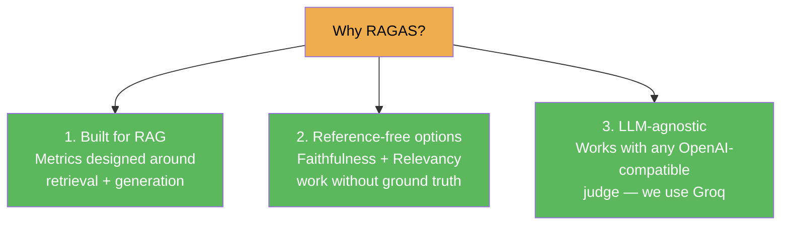

| Requirement | Why RAGAS fits |
|---|---|
| We have a retrieval + generation pipeline | RAGAS metrics map 1:1 to each pipeline stage |
| We don't always have ground-truth answers | Faithfulness and Relevancy work without `reference` |
| We use Groq (not OpenAI) | RAGAS `llm_factory` + `AsyncOpenAI(base_url=groq_url)` works cleanly |
| We want separate metrics per failure mode | 5 independent scores, not one combined number |
| Token cost | `llama-3.1-8b-instant` as judge keeps costs near zero |

**DeepEval is used for Tool Correctness only** — because RAGAS doesn't have a tool testing metric, and DeepEval's Jaccard-based tool check is deterministic (zero LLM cost).

---

## RAGAS 0.4.3 — Key API Rules

> This project runs RAGAS **0.4.3**. The API is different from older tutorials online. These rules prevent the most common errors.

### Rule 1 — Use `llm_factory`, not `LangchainLLMWrapper`

`ragas.metrics.collections` metrics require `InstructorLLM` internally. `LangchainLLMWrapper` is rejected.

```python
# ❌ WRONG — throws "Collections metrics only support modern InstructorLLM"
from ragas.llms import LangchainLLMWrapper
judge = LangchainLLMWrapper(ChatGroq(...))

# ✅ CORRECT
from openai import AsyncOpenAI
from ragas.llms import llm_factory

groq_client = AsyncOpenAI(
    api_key=GROQ_API_KEY,
    base_url="https://api.groq.com/openai/v1"
)
judge_llm = llm_factory("llama-3.1-8b-instant", provider="openai", client=groq_client)
```

### Rule 2 — Use `AsyncOpenAI`, not `Groq` or `OpenAI` (sync)

```python
# ❌ WRONG — Groq client has no .messages attribute
from groq import Groq
client = Groq(api_key=...)

# ❌ WRONG — sync client can't be awaited
from openai import OpenAI
client = OpenAI(...)

# ✅ CORRECT
from openai import AsyncOpenAI
client = AsyncOpenAI(api_key=GROQ_API_KEY, base_url="https://api.groq.com/openai/v1")
```

### Rule 3 — Use `abatch_score()`, not `evaluate()`

`ragas.metrics.collections` metrics are NOT subclasses of `ragas.metrics.Metric`. `from ragas import evaluate()` rejects them.

```python
# ❌ WRONG — TypeError: All metrics must be initialised metric objects
from ragas import evaluate
evaluate(dataset, metrics=[Faithfulness(llm=judge_llm)])

# ✅ CORRECT — call abatch_score directly, use top-level await in Jupyter
_m = Faithfulness(llm=judge_llm)
_inputs = [{"user_input": s.user_input, "response": s.response,
            "retrieved_contexts": s.retrieved_contexts} for s in samples]
_res = await _m.abatch_score(_inputs)
scores = [float(r.value) for r in _res]
```

### Rule 4 — Each metric has a different `abatch_score` input signature

| Metric | Required keys in the input dict |
|--------|--------------------------------|
| `Faithfulness` | `user_input`, `response`, `retrieved_contexts` |
| `AnswerRelevancy` | `user_input`, `response` |
| `ContextPrecision` | `user_input`, `reference`, `retrieved_contexts` |
| `ContextRecall` | `user_input`, `retrieved_contexts`, `reference` |
| `AnswerCorrectness` | `user_input`, `response`, `reference` |

---

## Token Budget, Rate Limits, and Cooldowns

### Why This Matters

RAGAS metrics work by asking a judge LLM to evaluate each sample. That means **every `abatch_score()` call fires multiple real API requests**. Run 5 experiments back-to-back with no pause and you will hit Groq's rate limit mid-notebook, get a 429 error, and your eval run fails.

This section explains exactly how many tokens each metric costs, what Groq's limits are, why 60 seconds is the right cooldown, and how the code handles all of it.

---

### Groq Free Tier Limits

| Limit Type | `llama-3.1-8b-instant` | `llama-3.3-70b-versatile` |
|---|---|---|
| **TPM** (Tokens Per Minute) | 6,000 (on_demand) | ~6,000 |
| **TPD** (Tokens Per Day) | ~500,000 | ~100,000 |
| **RPM** (Requests Per Minute) | ~30 | ~30 |

> These are approximate free-tier limits. Paid tiers are significantly higher.
> We use `llama-3.1-8b-instant` as the judge — it has the highest TPM on free tier, making it the right choice for eval workloads.

**TPM** = how many tokens you can send + receive in any 60-second window.
**TPD** = how many tokens total across the whole day before the key is locked.

The TPM limit is the binding constraint for a notebook — if you fire 5 experiments in rapid succession, you burn through it in seconds.

---

### How Many Tokens Does Each Metric Actually Use?

Each RAGAS metric makes a different number of internal LLM calls because it asks the judge different questions. Here is the full breakdown:

#### Faithfulness (2 calls per sample)
```
Call 1 — Statement extraction:
  "Break this response into individual factual statements."
  Input:  ~100 tokens (response text)
  Output: ~150 tokens (list of statements)
  Total:  ~250 tokens

Call 2 — Verification:
  "For each statement, is it supported by the context? Yes/No."
  Input:  ~200 tokens (statements + context)
  Output: ~100 tokens (verdicts)
  Total:  ~300 tokens

Per sample: ~550 tokens   |   3 samples: ~1,650 tokens
```

#### Answer Relevancy (1 call per sample)
```
Call 1 — Question generation + embedding:
  "Generate questions whose answer would be this response."
  Input:  ~100 tokens (response)
  Output: ~150 tokens (generated questions)
  Then cosine similarity via embeddings (no LLM cost)
  Total:  ~250 tokens

Per sample: ~250 tokens   |   3 samples: ~750 tokens
```

#### Context Precision (2 calls per sample)
```
Call 1 — Relevance check per chunk:
  "Is this chunk relevant to the reference answer? Yes/No."
  Input:  ~150 tokens (chunk + reference)
  Output: ~50 tokens (verdict)

Call 2 — Repeated for each chunk in retrieved_contexts
  (Cost scales with number of chunks you provide)
  Average: ~350 tokens total across all chunks

Per sample: ~350 tokens   |   3 samples: ~1,050 tokens
```

#### Context Recall (2 calls per sample)
```
Call 1 — Sentence extraction from reference:
  "List the sentences in this reference answer."
  Input:  ~100 tokens
  Output: ~100 tokens

Call 2 — Attribution check:
  "Can each reference sentence be found in the context? Yes/No."
  Input:  ~200 tokens (sentences + context)
  Output: ~100 tokens (verdicts)
  Total:  ~350 tokens

Per sample: ~350 tokens   |   3 samples: ~1,050 tokens
```

#### Answer Correctness (3 calls per sample)
```
Call 1 — Statement extraction from response:
  ~200 tokens

Call 2 — Statement extraction from reference:
  ~200 tokens

Call 3 — Factual overlap classification:
  "Which response statements match / contradict / are missing from reference?"
  ~300 tokens
  Plus embedding similarity (no LLM cost)

Per sample: ~700 tokens   |   3 samples: ~2,100 tokens
```

---

### Full Notebook Token Budget

| Experiment | Metric | Calls / sample | ~Tokens / sample | 3 samples total |
|---|---|---|---|---|
| Exp 1 | Faithfulness | 2 | ~550 | ~1,650 |
| Exp 2 | Answer Relevancy | 1 | ~250 | ~750 |
| Exp 3 | Context Precision | 2 | ~350 | ~1,050 |
| Exp 4 | Context Recall | 2 | ~350 | ~1,050 |
| Exp 5 | Answer Correctness | 3 | ~700 | ~2,100 |
| Exp 6 | Tool Correctness | **0** | **0** | **0** |
| **TOTAL** | | | | **~6,600 tokens** |

> Tool Correctness is pure Jaccard math — zero LLM calls, zero tokens, zero cost.

**Compared to the 14,400 TPM limit:**

```
~6,600 tokens total across 5 experiments

If run with NO cooldown (back to back in ~2 minutes):
  6,600 tokens / 2 min = ~3,300 tokens/min  →  well within TPM ✅

BUT each experiment runs in a burst — all 3 samples fire in ~10 seconds:
  Exp 1 burst: ~1,650 tokens in 10 seconds = ~9,900 tokens/min equivalent ❌
  Exp 5 burst: ~2,100 tokens in 10 seconds = ~12,600 tokens/min equivalent ❌
```

This is why 429 errors happen — it's not about total volume, it's about **burst rate**. Three samples evaluated simultaneously can spike the per-minute rate above the limit.

---

### The Cooldown Strategy

The cooldown gives Groq's rate limit window time to reset before the next experiment fires.

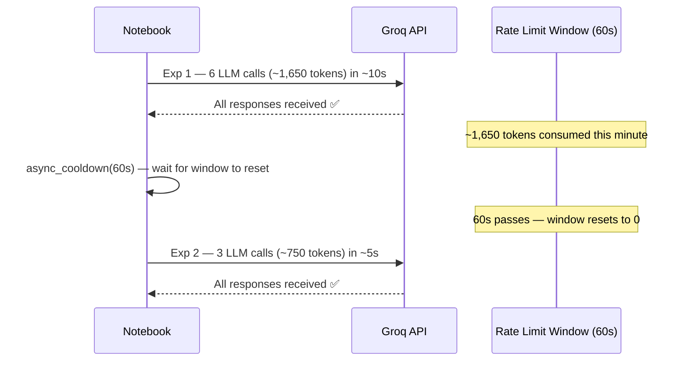

**Why 60 seconds specifically?**

Groq's rate limit window is **1 minute**. Waiting 60 seconds guarantees the previous experiment's token consumption has fully rolled out of the window before the next one starts.

```
Consumed in Exp 1 burst:  ~1,650 tokens in minute 0
After 60s cooldown:        minute 0 window expired
Exp 2 starts in minute 1:  fresh 14,400 TPM available
```

---

### The `async_cooldown()` Function

```python
async def async_cooldown(seconds=60):
    """Async cooldown — works inside Jupyter's running event loop."""
    print(f"\n⏳ Cooldown {seconds}s (Groq rate-limit buffer)...", end=" ")
    for _ in range(seconds // 10):
        await asyncio.sleep(10)
        print(".", end="", flush=True)
    print("  ✅ Ready.\n")
```

**Why `asyncio.sleep` and not `time.sleep`?**

Jupyter runs an event loop. `time.sleep(60)` blocks the entire thread — the notebook freezes and shows no output for a full minute. `asyncio.sleep(10)` yields control back to the event loop every 10 seconds, so the progress dots (`......`) print in real time. Same total wait, much better experience.

```
time.sleep(60)      →  notebook frozen, no output, looks broken
asyncio.sleep(10)×6 →  "⏳ . . . . . .  ✅ Ready." — visible progress
```

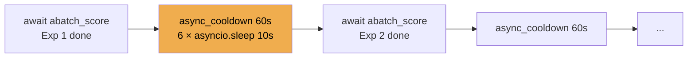

---

### The Two-Key Strategy

Running all 5 LLM experiments uses ~6,600 tokens. That is well within the **500,000 TPD** limit on a single key. However, there is still a reason to use a separate judge key:

**Problem:** Your main `GROQ_API_KEY` is also used by the production RAG app at `app/main.py`. If the eval notebook exhausts the TPM limit, your API is temporarily blocked — **the live app breaks**.

**Solution:** Use a second free Groq key (`JUDGE_GROQ`) exclusively for eval workloads.

```python
# .env
GROQ_API_KEY=<main key — used by the production app>
JUDGE_GROQ=<second key — used only by eval notebooks>

# notebook — uses judge key, falls back to main if JUDGE_GROQ not set
JUDGE_GROQ_API_KEY = os.getenv("JUDGE_GROQ", os.getenv("GROQ_API_KEY"))
```

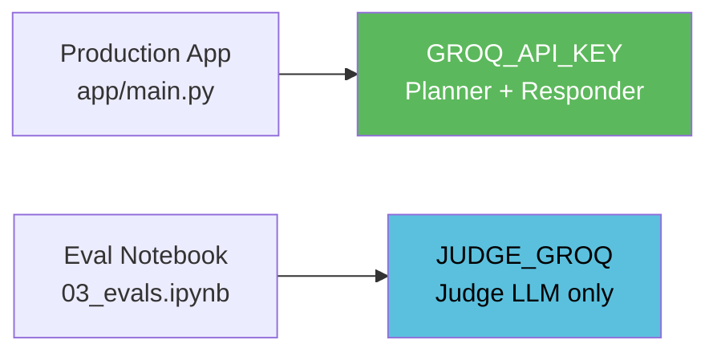

This isolation means a heavy eval run can never rate-limit your production system.

---

### Token Efficiency Tips

| Tip | Why |
|---|---|
| Use `llama-3.1-8b-instant` as judge, not `70b` | Both on on_demand tier share 6,000 TPM — 8b is faster so retries cost less |
| Use local HuggingFace embeddings | Zero token cost for Answer Relevancy + Correctness embedding step |
| Keep samples small (3 per experiment) | Enough to validate metric behaviour, stays well within limits |
| Tool Correctness last — no cooldown needed | Zero LLM calls — can run immediately after Exp 5 |
| 60s cooldown after each LLM experiment | Guarantees the 1-minute window fully resets |

---

## The 6 Experiments — What We Test and Why

Each experiment uses a **different everyday domain** so the scenarios are intuitive and relatable. In production we'd use Kubernetes data — but in a learning notebook, using domains everyone knows (e-commerce, travel, cooking) makes it easier to spot what's right and wrong.

| Exp | Domain | Metric | What the bad sample does |
|-----|--------|--------|--------------------------|
| 1 | 🛒 E-commerce Returns | Faithfulness | Answer says "free shipping" when context says "customer pays" |
| 2 | ✈️ Japan Travel | Answer Relevancy | Answer talks about food when user asked about rail passes |
| 3 | 💻 Python Coding | Context Precision | Useful chunk buried under 2 irrelevant chunks |
| 4 | 🍳 Cooking / Recipes | Context Recall | Context has pasta trivia, not cooking instructions |
| 5 | 🌍 General Knowledge | Answer Correctness | Answer says Venus is closest to Sun, not Mercury |
| 6 | 🏠 Smart Home Agent | Tool Correctness | Agent calls lights tool when user asked for music |

### Expected Score Pattern

Every experiment has 3 samples: Good / Medium / Bad. This validates the metric is working correctly — if Good scores 0.0 and Bad scores 1.0, the metric is broken.

```
Good   →  🟢 High score   (metric should reward correct behaviour)
Medium →  🟡 Mid score    (metric should penalise partial failure)
Bad    →  🔴 Low score    (metric should catch the failure clearly)
```

---

## Tool Correctness — No LLM Needed

Tool Correctness uses a **Jaccard score** — pure set overlap between tools called and tools expected. No LLM, no embeddings, no API key, no cost.

```
score = |called ∩ expected| / |called ∪ expected|
```

| Scenario | Called | Expected | Intersection | Union | Score |
|----------|--------|----------|-------------|-------|-------|
| Good | {control_smart_light} | {control_smart_light} | 1 | 1 | **1.0** 🟢 |
| Medium | {control_smart_light} | {play_music} | 0 | 2 | **0.0** 🔴 |
| Bad | {set_thermostat, send_notification} | {set_thermostat} | 1 | 2 | **0.5** 🟡 |

This penalises **both** missing tools (recall failure) and extra tools (precision failure) in one score.

---

## When to Run Which Metrics in Production

| Event | Run these metrics |
|-------|------------------|
| After changing the LLM model | Faithfulness + Answer Correctness |
| After changing the retriever / top-k | Context Precision + Context Recall |
| After changing the system prompt | Answer Relevancy |
| After adding or modifying tools | Tool Correctness |
| Before any production release | All 6 |
| After updating the knowledge base | Context Recall + Faithfulness |

---

## Quick Reference

```
ragas version      → 0.4.3
judge LLM          → llm_factory("llama-3.1-8b-instant", provider="openai", client=AsyncOpenAI(...))
embeddings         → HuggingFaceEmbeddings(model="sentence-transformers/all-MiniLM-L6-v2", use_api=False)
scoring call       → await metric.abatch_score(list_of_dicts)   ← NOT evaluate()
score extraction   → float(result.value)
cooldown           → 60s async sleep between experiments (Groq rate limit)
judge key          → JUDGE_GROQ env var (separate from main GROQ_API_KEY)
tool correctness   → manual Jaccard — no DeepEval ToolCorrectnessMetric (requires OpenAI key)
```

---

## See Also

- `notebooks/03_evals.ipynb` — all 6 experiments runnable end-to-end
- `app/agents/nodes/planner.py` — the node whose tool routing Tool Correctness validates
- `app/agents/nodes/responder.py` — the node Faithfulness and Answer metrics validate
- `DOCS/03_NODE_INTELLIGENCE.md` — how the planner/retriever/responder nodes work
- `DOCS/07_FLASHRANK_RERANKING.md` — the reranking step that Context Precision validates
