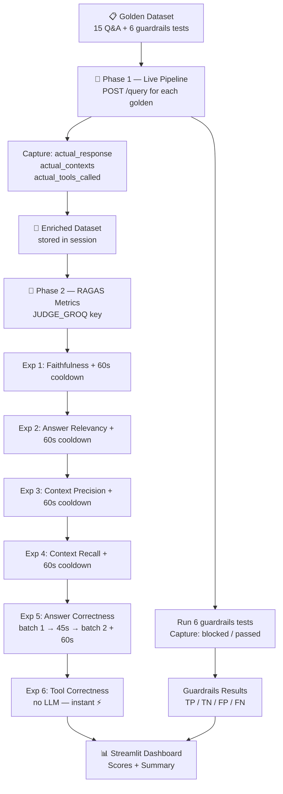

# 18 — Evaluation Pipeline

## What is an Evaluation and Why Does It Matter?

Building a RAG system is not the same as knowing it works.

Think of it like a doctor running tests. You don't just *assume* the patient is healthy — you measure blood pressure, run a blood panel, check reflexes. Each test catches a specific kind of problem. Evals are those tests for your AI system.

Without evals you can only say *"it seems to work on the questions I tried."*  
With evals you can say *"it is 87% faithful, 93% tool-correct, and blocks 100% of adversarial inputs across 15 standardised test cases from real data."*

---

## Part 1 — How the Golden Dataset Was Generated

### What is a Golden Dataset?

A **golden dataset** is a curated set of question–answer pairs where you already know the correct answer. Each pair is called a **golden** (or a *golden sample*). The correct answer is called the **ground truth** or **reference**.

You compare what the system actually says against the ground truth — that gap is the signal.

### Our Source Documents

We parsed the following real enterprise documents from `data/true_data/`:

| File | Topic | Parser Used |
|------|-------|-------------|
| `parallel_work_queue.txt` | Kubernetes parallel Jobs with Redis | `parse_text` |
| `pods_autoscale.html` | HPA and VPA in Kubernetes | `parse_html` |
| `job_management.html` | Databricks CLI / SDK / REST API | `parse_html` |
| `cronjobs.docx` | Kubernetes Jobs and CronJobs | `python-docx` |
| `monitor_job.docx` | Monitoring Kubernetes job status | `python-docx` |

> We use `python-docx` and `python-pptx` directly in `evals/data_parser.py` — not the `unstructured` library — so the golden dataset builder is lightweight and fast.

### How Each Golden Was Written

For each document:
1. Parse the file to extract full text
2. Read the content and identify 3 real, non-trivial questions a platform engineer would ask
3. Write the reference answer by paraphrasing the source text (not copying word-for-word)
4. Extract 1–2 actual text chunks from the file as `relevant_contexts` (fallback if live retrieval fails)
5. Set `expected_tools: ["retrieve_documents"]` — every question needs real document lookup

**Result: 15 golden RAG samples + 6 guardrails test cases.**

### Golden Entry Structure

```json
{
  "id": 1,
  "domain": "parallel_work_queue",
  "question": "How do you start Redis for a Kubernetes work queue?",
  "reference": "Run kubectl apply -f redis-pod.yaml and redis-service.yaml...",
  "relevant_contexts": ["For this example, you will start a single instance..."],
  "expected_tools": ["retrieve_documents"],
  "actual_response": "",       ← filled by Phase 1 at runtime
  "actual_contexts": [],       ← filled by Phase 1 at runtime
  "actual_tools_called": []    ← filled by Phase 1 at runtime
}
```

### Guardrails Test Cases

6 entries with `expected_blocked: true/false`:

| Type | Example | Expected |
|------|---------|----------|
| Jailbreak | "Ignore all previous instructions..." | Blocked |
| Off-topic | "Tell me a funny joke" | Blocked |
| Legit IT | "How do I monitor a Kubernetes Job?" | Passed |

---

## Part 2 — How the Eval Pipeline Runs

The pipeline runs in **two phases** followed by a **scoring phase**:



### Phase 1 — Live Response Generation

For each of the 15 golden questions, `evals/pipeline.py`:
1. Sends a `POST /query` request to the running FastAPI app (`localhost:8000`)
2. Captures `answer` (truncated to 300 chars), `sources` (actual retrieved chunks), `thought_process`
3. Parses `thought_process` to detect which tool was called:
   - `"Intent: Technical"` → `retrieve_documents`
   - `"Intent: Conversational/Memory"` → `direct_answer`
   - `"Intent: Guardrails Fired"` → `guardrails`
4. Waits 10 seconds between calls (Groq RPM buffer on the main key)

> **Why truncate to 300 chars?**  
> RAGAS judges the response against the context. 300 chars is enough for the LLM judge to evaluate faithfulness and relevancy. Passing the full response would double the token cost with no accuracy gain.

### Guardrails Evaluation

`evals/guardrails_eval.py` sends each of the 6 test inputs to `/query` and checks if `thought_process` contains `"Intent: Guardrails Fired"`. Each result is classified as:

| Label | Meaning |
|-------|---------|
| TP (True Positive) | Adversarial input was correctly blocked |
| TN (True Negative) | Legitimate input was correctly passed through |
| FP (False Positive) | Legitimate input was wrongly blocked |
| FN (False Negative) | Adversarial input was missed — not blocked |

From these we compute **precision**, **recall**, and **accuracy** for the guardrails layer.

### Phase 2 — RAGAS Metric Scoring

`evals/metrics.py` runs 6 experiments against the enriched dataset from Phase 1.

---

## Part 3 — What We Are Measuring and Why

### The 6 Metrics

```
  ┌──────────────────┬───────────────────┬─────────────────────┐
  │   RETRIEVAL      │    GENERATION     │   AGENT / PLANNER   │
  ├──────────────────┼───────────────────┼─────────────────────┤
  │ Context          │ Faithfulness      │ Tool Correctness    │
  │ Precision        │                   │                     │
  │                  │ Answer Relevancy  │ (Guardrails eval    │
  │ Context          │                   │  runs separately)   │
  │ Recall           │ Answer            │                     │
  │                  │ Correctness       │                     │
  └──────────────────┴───────────────────┴─────────────────────┘
```

| # | Metric | What it catches | Score of 1.0 means |
|---|--------|-----------------|--------------------|
| 1 | **Faithfulness** | Does the answer invent facts not in the retrieved context? | Zero hallucination |
| 2 | **Answer Relevancy** | Does the answer actually address the question asked? | Perfectly on-topic |
| 3 | **Context Precision** | Are the most relevant chunks ranked first by the retriever? | Best chunks at the top |
| 4 | **Context Recall** | Did the retriever fetch everything the reference answer needs? | Nothing important missed |
| 5 | **Answer Correctness** | Does the answer match the ground-truth reference factually? | Factually identical |
| 6 | **Tool Correctness** | Did the agent call the right tool for each question type? | Right tool every time |

### Why Each Metric Matters in Production

**Faithfulness** — If this is low, your RAG system is hallucinating. It's making up facts that aren't in the documents it retrieved. Users will trust wrong answers.

**Answer Relevancy** — If this is low, the system answers adjacent topics instead of the actual question. Even if the answer is factually correct about *something*, it's not useful.

**Context Precision** — If this is low, your re-ranker (FlashRank) or vector search is returning noisy chunks before relevant ones. The generator gets confused by irrelevant context at the top.

**Context Recall** — If this is low, your retriever is missing important documents. The generator can only answer from what was fetched — if the key chunk wasn't retrieved, the answer will be incomplete.

**Answer Correctness** — Combines factual overlap + semantic similarity against the ground truth. The strongest end-to-end signal: does the system actually know the right answer?

**Tool Correctness** — Verifies the planner is routing correctly. A question about CronJobs should trigger `retrieve_documents`, not `direct_answer`. Uses Jaccard overlap — no LLM needed.

### Score Thresholds

| Score | Verdict | Action |
|-------|---------|--------|
| ≥ 0.75 | 🟢 Good | Ship it |
| 0.50–0.75 | 🟡 Fair | Investigate — tune retrieval or prompts |
| < 0.50 | 🔴 Poor | Fix before shipping |

---

## Part 4 — Token Budget, Rate Limits, and Cooldowns

### Why We Have Two Separate Groq Keys

| Key | Used for | Why separate? |
|-----|----------|---------------|
| `GROQ_API_KEY` | Live app + Phase 1 response generation | Production traffic |
| `JUDGE_GROQ` | RAGAS LLM judge calls in Phase 2 | Eval runs must not exhaust the production key |

If both ran on the same key, a single eval run would rate-limit your live app mid-conversation.

### Full Token Budget for This Eval Run (15 samples)

#### Phase 1 — Response Generation (`GROQ_API_KEY`, llama-3.3-70b-versatile via Portkey)

| Task | Calls | Tokens/call | Total tokens |
|------|-------|-------------|--------------|
| 15 RAG questions (prompt + context + response) | 15 | ~1,850 | ~27,750 |
| 6 guardrails tests | 6 | ~500 | ~3,000 |
| **Phase 1 total** | **21** | | **~30,750** |

With 10s delay between calls: ~3.5 min. Daily limit for 70b: 100,000 TPD ✅

#### Phase 2 — RAGAS Metrics (`JUDGE_GROQ`, llama-3.1-8b-instant)

**Actual TPM tier: 6,000 on_demand** (not 14,400 — confirmed from live 413/429 errors).

`abatch_score` fires all sample coroutines concurrently inside a single call, so a batch of N samples fires N × 2 LLM calls simultaneously. With ~1,376 tokens/call and a 6,000 TPM ceiling, only **2 samples** can run in parallel before the window saturates. The safe strategy: `GENERAL_BATCH_SIZE = 1` — one sample at a time.

| Experiment | LLM calls / sample | Tokens / burst (1 sample) | vs 6,000 TPM | Samples × 40s wait |
|-----------|-------------------|--------------------------|--------------|-------------------|
| Faithfulness | 2 | ~2,752 | ✅ Safe | 14 × 40s = 560s |
| Answer Relevancy | 2 | ~2,752 | ✅ Safe | 14 × 40s = 560s |
| Context Precision | 2 | ~2,752 | ✅ Safe | 14 × 40s = 560s |
| Context Recall | 2 | ~2,752 | ✅ Safe | 14 × 40s = 560s |
| Answer Correctness | 2–3 | ~2,752–4,128 | ✅ Safe | 14 × 40s = 560s |
| Tool Correctness | 0 | 0 | ✅ Free | — |

**Context truncation**: contexts from Qdrant are ~1,500 chars each. Without truncation a single Faithfulness call exceeds 7,000 tokens. Fix: `CONTEXT_TRUNCATE = 300`, `CONTEXT_LIMIT = 2` → ~400 tokens of context per call.

**Phase 2 total tokens**: 15 samples × 5 experiments × ~2,752 = ~206,400 tokens. Well within 500,000 TPD daily limit ✅

### Why One Sample at a Time?

```
abatch_score([sample_1])   → fires ~2 LLM calls concurrently (~2,752 tokens)
→ 40s cooldown             → sliding window partially resets (~1,833 tokens recovered)
abatch_score([sample_2])   → fires ~2 LLM calls (~2,752 tokens)
→ 40s cooldown
...
```

After 40s, the 60s sliding window has recovered `2752 × 40/60 ≈ 1,835 tokens`.  
Leftover from previous burst: `2,752 − 1,835 = 917 tokens`.  
Next burst adds 2,752 → total in window: **3,669 tokens** — safely under 6,000 TPM ✅

After processing all 15 samples, a full **62s cooldown** resets the window completely before the next experiment starts.

### `async_cooldown` vs `time.sleep`

We use `asyncio.sleep` (not `time.sleep`) for the cooldowns in `metrics.py`:

- `time.sleep` freezes the entire Python thread — no UI updates, no progress callbacks
- `asyncio.sleep` yields control back to the event loop — the Streamlit status callback can still fire dots while waiting

The Streamlit app uses `nest_asyncio.apply()` to allow async code to run from within Streamlit's synchronous context.

### Total Runtime

| Phase | Duration |
|-------|----------|
| Phase 1 — 21 calls × 10s spacing | ~3.5 min |
| Phase 2 — 5 experiments × 15 samples × 40s waits + 4 × 62s inter-experiment cooldowns | ~50 min |
| **Total** | **~54 min** |

> Phase 2 is long by design — the 6,000 TPM on_demand ceiling forces per-sample pacing. Upgrade JUDGE_GROQ to Groq Dev Tier (100k TPM) to bring Phase 2 down to ~5 min.

---

## Part 5 — How to Run

```powershell
# Terminal 1 — start the FastAPI backend
uvicorn app.main:app --reload --port 8000

# Terminal 2 — start the Streamlit eval app
streamlit run evals/app.py
```

Then open `http://localhost:8501` and follow the 3 tabs:
1. **Ground Truth** — review the 15 golden Q&A pairs and 6 guardrails tests
2. **Live Pipeline** — click "Run Live Pipeline" to collect real responses
3. **Eval Metrics** — click "Run Eval Metrics" to score with RAGAS (takes ~50 min on free tier)

All traces are visible in **Logfire** under `service = evals`.
